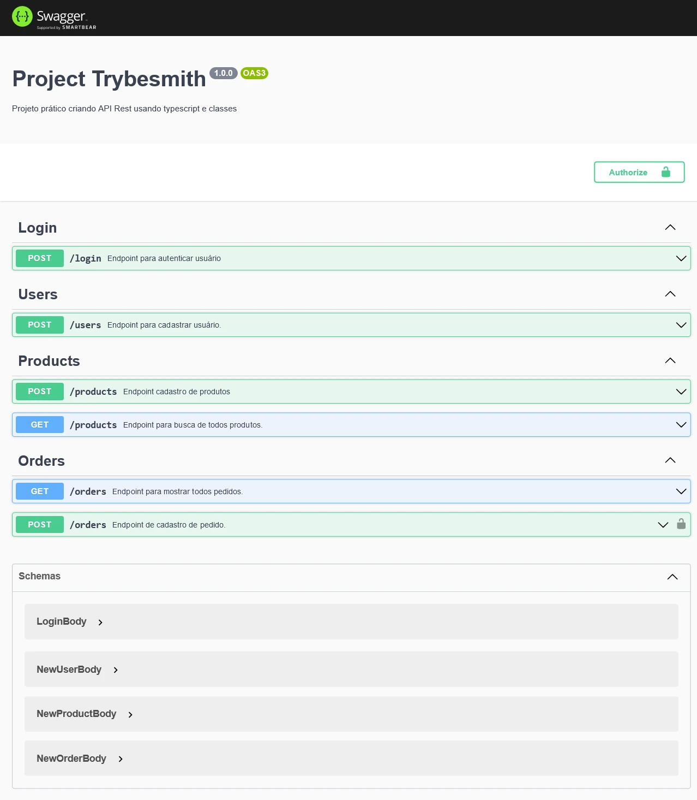
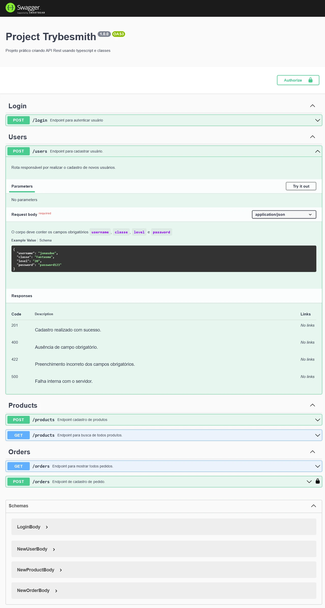
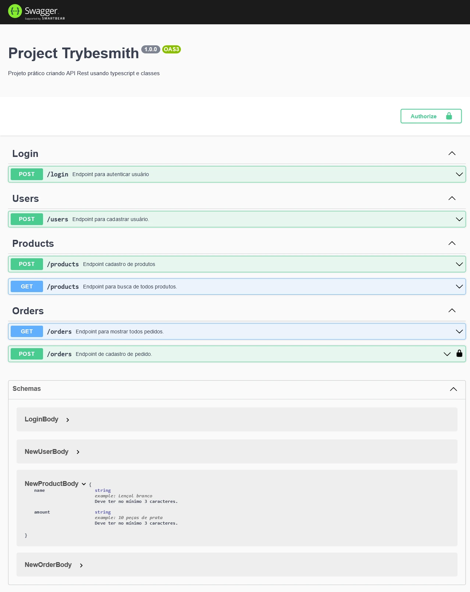

# Sobre

## Seção: `Introdução ao Typescript`

- lore

#
<div align="center">
  <a href="https://raw.githubusercontent.com/davidrogger/trybe-project-trybesmith/readme-update/readme-imgs/project_top.webp">
    
  </a>
  <a href="https://raw.githubusercontent.com/davidrogger/trybe-project-trybesmith/readme-update/readme-imgs/project_mid.webp">
    
  </a>
  <a href="https://raw.githubusercontent.com/davidrogger/trybe-project-trybesmith/readme-update/readme-imgs/project_bot.webp">
    
  </a>
</div>

>*Imagens da documentação swagger*
#
## Projeto: `Trybesmith`

- lore

# Tecnologias e ferramentas usadas 🛠


# Desafios

- lore

# Conclusão

- lore

</details>

<details>
  <summary>
    <strong>
      :newspaper_roll: Requisitos solicitados durante o desenvolvimento do projeto
    </strong>
  </summary>

 
  ### Requisitos
  *Nome* | *Avaliação*
  --- | :---:
  1 - Crie um endpoint para o cadastro de produtos | :heavy_check_mark:
  2 - Crie um endpoint para a listagem de produtos | :heavy_check_mark:
  3 - Crie um endpoint para o cadastro de pessoas usuárias | :heavy_check_mark:
  4 - Crie um endpoint para listar todos os pedidos | :heavy_check_mark:
  5 - Crie um endpoint para o login de pessoas usuárias | :heavy_check_mark:
  6 - Crie as validações dos produtos | :heavy_check_mark:
  7 - Crie as validações para as pessoas usuárias | :heavy_check_mark:
  8 - Crie um endpoint para o cadastro de um pedido | :heavy_check_mark:


</details>

<details>
  <summary>
    <strong>
      :memo: Todo list
    </strong>
  </summary>

  - [x] - ~~Criar aplicação com base nos requisitos da trybe.~~ 

</details>

<details>
  <summary>
    <strong>
      :computer: Instruções do  Projeto
    </strong>
  </summary>

> ### Importante seguir a ordem apresentada a baixo, para o funcionamento.

<details>
<summary>
  <strong>
    ⚠️ Configurações mínimas para execução do projeto
  </strong>
</summary>

  > - Sistema Operacional Distribuição Unix
  > - Node versão >= 16
  > - Docker
  > - Docker-compose versão >=1.29.2
  > - API Client ([Thunder Client](https://www.thunderclient.com/), [Insomnia](https://insomnia.rest/), [POSTMAN](https://www.postman.com/), ou algum outro de sua preferência)

  </details>

  <details>
  <summary>
    <strong>
      ⚠️ Inicie o docker-compose
    </strong>
  </summary>

  >Após clonar o respositório para iniciar o docker compose, você deve dentro da pasta raiz do projeto usar o comando: `docker-compose up -d`
  >Verifique os containers, usando o comando `docker ps` no terminal. Deve aparecer dois containers com o nome de *trybesmith* e *trybesmith_db*.
  </details>

  <details>
    <summary>
      <strong>
        🗂 Acessando as Rotas
      </strong>
    </summary>

  >Para acessar e testar as rotas:
  >1. Usando algum API Cliente, conforme citado nas configurações mínimas.
  >2. Acessando a documentação gerada pelo swagger `localhost:3000/api-docs`.

  <details>
  <summary>
      <span>Endpoint <code>/login</code></span>
  </summary>
  
  ## POST - `localhost:3000/login`

  > - Rota responsável autenticar usuário e gerar um token de acesso.
  > - Para autenticar o usuário, é necessário realizar uma requisição POST para URL: `localhost:3000/login` contendo um corpo json com:
  > - `username` Um usuário já cadastrado.
  > - `password` Senha correspondente ao usuário cadastrado.
  > ### Exemplo:
  >```
  >{
  >  "email": "reigal",
  >  "password": "1dragaonoceu"
  >}
  >```
  > ### Status:
  > - **`200`**: Retorna um json com o token para acessar rotas que precisam de autenticação.
  > - **`400`**: Retorna um json com a mensagem indicando qual campo está pendente na requisição.
  > - **`401`**: Retorna um json com a mensagem indicando que o usuário ou senha são inválidos.
  > - **`500`**: Retorna um json com a mensagem indicando o error que ocorreu internamente no servidor.

  </details>

  <details>
  <summary>
      <span>Endpoint <code>/users</code></span>
  </summary>

  
  ## POST - `localhost:3000/users`

  > - Rota responsável por cadastrar um novo usuário e gerar um token de acesso.
  > - Para cadastrar o usuário, é necessário realizar uma requisição POST para URL: `localhost:3000/users` contendo um corpo json com:
  > - `username` Não pode estar cadastrado e ter no mínimo 3 caractares.
  > - `classe` Mínimo de 3 caractares.
  > - `level` Ser um número acima de 1.
  > - `password` Mínimo de 8 caractares.
  > ### Exemplo:
  >```
  >{
  >  "username": "jonasdoe",
  >  "classe": "Fantasma",
  >  "level": "20",
  >  "password": "password123"
  >}
  >```
  > ### Status:
  > - **`200`**: Retorna um json com o token para acessar rotas que precisam de autenticação.
  > - **`400`**: Retorna um json com a mensagem indicando qual campo está pendente na requisição.
  > - **`422`**: Retorna um json com a mensagem indicando qual campo está incorreto.
  > - **`500`**: Retorna um json com a mensagem indicando o error que ocorreu internamente no servidor.

  </details>

  <details>
  <summary>
      <span>Endpoint <code>/products</code></span>
  </summary>

  
  ## POST - `localhost:3000/products`

  > - Rota responsável por cadastrar um novo produto.
  > - Para cadastrar o produto, é necessário realizar uma requisição POST para URL: `localhost:3000/products` contendo um corpo json com:
  > - `name` Mínimo 3 caractares.
  > - `amount` Mínimo de 3 caractares.
  > ### Exemplo:
  >```
  >{
  >  "name": "Lençol branco",
  >  "amount": "10 peças de prata",
  >}
  >```
  > ### Status:
  > - **`200`**: Retorna um json com os dados do produto cadastrado.
  > - **`400`**: Retorna um json com a mensagem indicando qual campo está pendente na requisição.
  > - **`422`**: Retorna um json com a mensagem indicando qual campo está incorreto.
  > - **`500`**: Retorna um json com a mensagem indicando o error que ocorreu internamente no servidor.

  ## GET - `localhost:3000/products`

  > - Rota responsável por mostrar todos produtos cadastrados.
  > - Para cadastrar o produto, é necessário realizar uma requisição GET para URL: `localhost:3000/products`.
  > ### Status:
  > - **`200`**: Retorna um json com todos os produtos cadastrados.
  > - **`500`**: Retorna um json com a mensagem indicando o error que ocorreu internamente no servidor.

  <details>
  <summary>
      <span>Endpoint <code>/orders</code></span>
  </summary>
  
  ## GET - `localhost:3000/orders`


  </details>

  </details>

  </details>

</details>

#

<div align="right">
  
</div>
